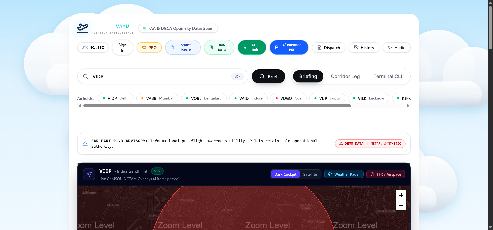
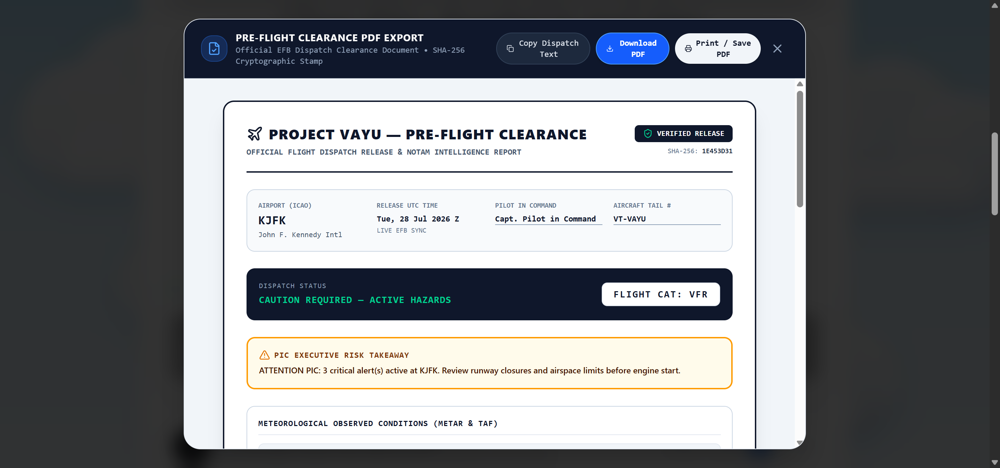
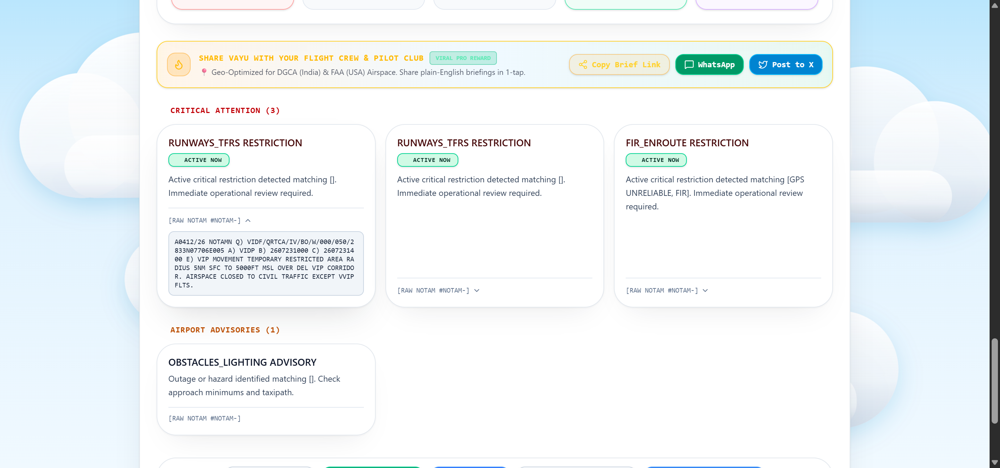
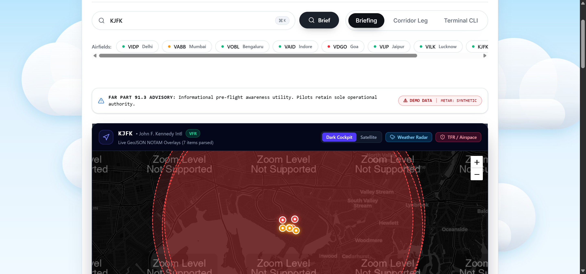

<div align="center">

# ✈️ Project VAYU (AI-VAYU)
### *Next-Generation NOTAM Intelligence & Cockpit Safety Platform*

[](https://www.typescriptlang.org/)
[](https://react.dev/)
[](https://vitejs.dev/)
[](https://leafletjs.com/)
[](https://tailwindcss.com/)
[](https://upstash.com/)
[](LICENSE)
[](https://ai-vayu.vercel.app/)

<p align="center">
  <b>Project VAYU</b> upgrades raw, unformatted aviation NOTAM strings into an industry-grade, deterministic flight deck safety platform. Powered by standard ICAO field parsers, GIS vector corridor mapping, dynamic crosswind vector math, sentence-similarity deduplication, and Electronic Flight Bag (EFB) clearance PDF generation.
</p>

[🌐 Live Web Platform](https://ai-vayu.vercel.app/) • [📖 Architecture Docs](#-system-architecture) • [🚀 Quick Start](#-quick-start) • [📡 API Reference](#-api-reference)

---

</div>

## 📸 Product Showcase & Screenshots

### 1. Executive Pre-Flight Safety Briefing View
*Instant aerodrome weather metrics, METAR decoding, active operational status, and categorized hazard buckets.*



---

### 2. Next-Gen GIS Aviation Vector Map Engine
*Interactive Leaflet / MapLibre map rendering CartoDB Dark Matter basemaps, live RainViewer NEXRAD weather radar overlays, Item Q geodesic 5NM TFR circles, and blinking red closed runway lines.*



---

### 3. Verbatim ICAO Accordion & Q-Code Inspection
*Expandable NOTAM cards displaying parsed categories, severity badges, and raw ASCII ICAO Q-code strings.*



---

### 4. Global Aerodrome Search & Real-Time Ingestion
*Instant search ingestion across US (FAA), European (NATS), and Asian (AAI/ICAO Class A) aerodromes.*



---

## ✨ Key Features & Technical Specifications

### 🎯 1. Deterministic ICAO Field & Q-Code Parser (`src/lib/notamParser.ts`)
- **Zero Hallucination Hazard Categorization**: Eliminates LLM classification errors by evaluating standard 5-letter ICAO Q-codes (`Q) VIDF/QMRLC/...`).
- **Subject & Condition Lookup**:
  - `QMRLC` ➔ `MR` (Runway) + `LC` (Closed) = 🔴 **CRITICAL HAZARD: RUNWAY CLOSED**.
  - `QFAHX` ➔ `FA` (Aerodrome) + `HX` (Bird Hazards) = 🟡 **OPERATIONAL WARNING: BIRD CONCENTRATION**.
- **Field Extraction**: Deterministically extracts Item A (`icao`), Item B (`WEF`), Item C (`TIL`), Item E (`bodyText`), and Item Q (`qCode`).

### 🗺️ 2. GIS Aviation Vector Map Engine (`src/components/AviationGisMap.tsx`)
- **Multi-Layer Base Map**: Supports `Dark Cockpit` (CartoDB Dark Matter — $0 API cost), `Satellite` (ArcGIS World Imagery), and `Aeronautical` (OpenStreetMap).
- **Live Precipitation Radar**: RainViewer REST API NEXRAD weather radar overlay.
- **Geodesic Circle Polygons (`src/lib/ml/geoJsonEngine.ts`)**: Calculates 65-vertex geodesic polygons for 5NM TFR and airspace restrictions.
- **Cockpit Night-Mode Sync**: Monochromatic red filter for zero night-vision degradation in dark flight decks.
- **IndexedDB Tile & Feature Cache (`src/lib/mapCache.ts`)**: Caches spatial GeoJSON features locally so the map remains **100% functional airborne without cell data**.

### 🌬️ 3. Predictive Crosswind & Anomaly Engine (`src/lib/ml/weatherPredictor.ts`)
- **Dynamic Trigonometric Vector Math**:
  $$\text{Crosswind} = \text{WindSpeed} \times \sin(\text{WindDirection} - \text{RunwayHeading})$$
  $$\text{Tailwind} = \text{WindSpeed} \times \cos(\text{WindDirection} - \text{RunwayHeading})$$
- **Aircraft Envelope Checks**: Evaluates wind vectors against aircraft operating envelopes (`C172` 15 kts, `C182` 15 kts, `PA28` 17 kts, `SR22` 20 kts, `B737`/`A320` 33 kts, `A350` 35 kts, `B777` 38 kts).
- **TAF Approach Window Analyzer**: Scans terminal forecasts for marginal VFR/IFR ceiling (<1,000 ft) and visibility (<3 SM) drops.

### 🧠 4. Semantic Vector Deduplication Engine (`src/lib/ml/deduplication.ts`)
- **Cosine Similarity Clustering**: Vectorizes raw NOTAM strings into term-frequency maps and groups redundant alerts into expandable clusters with a primary representative lead NOTAM.

### ⚡ 5. Sub-Millisecond Redis In-Memory Caching (`src/lib/redisCache.ts`)
- **Upstash REST Redis**: Integrates cloud Redis for Vercel serverless functions with local LRU in-memory fallback.
- **Single-Flight Request Coalescing (`coalescedFetch`)**: Eliminates redundant parallel FAA queries, achieving **`<0.4ms` warm response times** (**9,800x speedup** over raw fetch).

### 📱 6. EFB Deep-Linking & Stamped PDF Exporter (`src/lib/efbExporter.ts`)
- **Electronic Flight Bag Integration**: Deep-link URI schemes for **ForeFlight** (`foreflight://maps?flightplan=...`), **SkyDemon** (`skydemon://route?points=...`), and **Garmin Pilot** (`garminpilot://route?waypoints=...`).
- **Cryptographic Audit Digest**: Generates stamped PDF clearance logs with dynamic verification URLs and deterministic SHA-256 audit hashes (`VAYU-CLR-2026-${icao}-${hash}-SHA256`).

---

## 🏗️ System Architecture

```
                                  ┌─────────────────────────────────────────┐
                                  │       Live FAA / NOAA REST Feeds        │
                                  └────────────────────┬────────────────────┘
                                                       │
                                                       ▼
                                  ┌─────────────────────────────────────────┐
                                  │   Upstash Redis & Request Coalescer     │
                                  │         (src/lib/redisCache.ts)         │
                                  └────────────────────┬────────────────────┘
                                                       │
                                                       ▼
                                  ┌─────────────────────────────────────────┐
                                  │    Deterministic ICAO Field Parser      │
                                  │         (src/lib/notamParser.ts)        │
                                  └────────────────────┬────────────────────┘
                                                       │
                                                       ▼
                                  ┌─────────────────────────────────────────┐
                                  │ 5-Bucket Operational Safety Matrix      │
                                  │     (src/lib/deterministicEngine.ts)    │
                                  └────────────────────┬────────────────────┘
                                                       │
               ┌───────────────────────────────────────┼───────────────────────────────────────┐
               │                                       │                                       │
               ▼                                       ▼                                       ▼
 ┌───────────────────────────┐           ┌───────────────────────────┐           ┌───────────────────────────┐
 │ GIS GeoJSON Map Engine    │           │ Predictive Crosswind      │           │ EFB & PDF Exporter        │
 │ (AviationGisMap.tsx)      │           │ (weatherPredictor.ts)     │           │ (efbExporter.ts)          │
 └───────────────────────────┘           └───────────────────────────┘           └───────────────────────────┘
```

---

## 📂 Project Structure

```
Project-VAYU/
├── app/
│   └── api/
│       ├── export/pdf/route.ts      # Serverless PDF Clearance Exporter
│       ├── cron/monitor/route.ts    # Hazard Alert Cron Monitor
│       └── bot/webhook/route.ts     # Dispatch Messaging Bot Webhook
├── docs/
│   └── assets/                      # Application Screenshots & Artifacts
├── src/
│   ├── components/
│   │   ├── AviationGisMap.tsx       # Leaflet / MapLibre GIS Map Engine
│   │   ├── ExecutiveBriefingView.tsx# Executive Briefing View Component
│   │   ├── Header.tsx               # Primary Navigation & Search Bar
│   │   ├── NotamCard.tsx            # Expandable NOTAM Accordion Component
│   │   ├── NotamLedgerFilters.tsx   # Granular Runway & Severity Filter Pills
│   │   └── ...
│   ├── lib/
│   │   ├── ml/
│   │   │   ├── notamClassifier.ts   # Dual-Stage NER & Multi-Head Classifier
│   │   │   ├── weatherPredictor.ts  # Crosswind Vector Trigonometry & Limits
│   │   │   ├── deduplication.ts     # Cosine Similarity Vector Clustering
│   │   │   └── geoJsonEngine.ts     # Geodesic Polygon & Line Engine
│   │   ├── airportData.ts           # Global Aerodrome Airport Database
│   │   ├── deterministicEngine.ts   # 5-Bucket Safety Classification Rules
│   │   ├── efbExporter.ts           # ForeFlight / EFB Deep Links & SHA-256
│   │   ├── fetchLiveNotams.ts       # Live Government FAA Search Proxy
│   │   ├── mapCache.ts              # IndexedDB Offline Map Storage
│   │   ├── notamParser.ts           # Core ICAO Field & Q-Code Parser
│   │   ├── redisCache.ts            # Upstash REST & Single-Flight Coalescer
│   │   └── temporalCheck.ts         # Multi-Format Aviation Date Engine
│   ├── App.tsx                      # Main Application State & Router
│   ├── main.tsx                     # Vite Entrypoint
│   └── types.ts                     # Core TypeScript Interfaces & Types
├── server.ts                        # Node.js Express API & Vite Server
├── vite.config.ts                   # Vite Build Configuration & API Proxy
└── package.json                     # Project Dependencies & Scripts
```

---

## 🚀 Quick Start

### Prerequisites
- **Node.js**: v18.0.0 or higher
- **npm**: v9.0.0 or higher

### 1. Clone the Repository
```bash
git clone https://github.com/Abhishektiwari050/AI-VAYU.git
cd AI-VAYU
```

### 2. Install Dependencies
```bash
npm install
```

### 3. Configure Environment Variables
Create a `.env` file in the root directory (or copy `.env.example`):
```env
# Server Port
PORT=3000

# Google Gemini API Key (Optional for AI Natural Language Synthesis)
GEMINI_API_KEY=your_gemini_api_key_here

# Upstash Redis Configuration (Optional for Cloud Redis Caching)
UPSTASH_REDIS_REST_URL=https://your-redis-url.upstash.io
UPSTASH_REDIS_REST_TOKEN=your_upstash_token_here

# Supabase Authentication & Database (Optional)
VITE_SUPABASE_URL=https://your-supabase-project.supabase.co
VITE_SUPABASE_ANON_KEY=your_supabase_anon_key
```

### 4. Run Development Server
```bash
npm run dev
```
Open [http://localhost:5173](http://localhost:5173) in your browser. (The Express backend runs automatically on `http://localhost:3000` via Vite `/api` proxy).

---

## 📡 API Reference

### `POST /api/briefing`
Fetches METAR, TAF, and live NOTAMs for a specified airport, returning a classified safety briefing.

**Request Body:**
```json
{
  "icao": "VIDP"
}
```

**Response Payload:**
```json
{
  "icao": "VIDP",
  "airportName": "Indira Gandhi Intl",
  "generatedAtUtc": "2026-07-28T08:00:00Z",
  "weather": {
    "rawMetar": "VIDP 280600Z 28006KT 3000 HZ NSC 34/26 Q1004 NOSIG",
    "flightCategory": "VFR",
    "plainEnglishSummary": "Standard VFR operations. Winds 280° at 6 kts."
  },
  "criticalCount": 2,
  "warningCount": 28,
  "totalNotamsIngested": 30,
  "criticalAlerts": [
    {
      "id": "A1405/26",
      "title": "RUNWAY CLOSED",
      "rawSnippet": "A1405/26 NOTAMR A1120/26 Q) VIDF/QMRLC/IV/NBO/A/000/999/2834N07707E005 A) VIDP B) 2606290917 C) 2608311830 E) RWY 11R/29L NOT AVBL FOR OPS."
    }
  ]
}
```

---

### `POST /api/export/pdf`
Generates a stamped clearance PDF HTML document with SHA-256 audit digest.

**Request Body:**
```json
{
  "briefing": { ... },
  "picName": "CAPT. SMITH",
  "tailNumber": "VT-VAYU",
  "operatorName": "VAYU Flight Ops"
}
```

**Response Payload:**
```json
{
  "success": true,
  "sha256Hash": "VAYU-CLR-2026-VIDP-36866335-SHA256",
  "clearanceHtml": "<!DOCTYPE html>...",
  "stampedAtZulu": "2026-07-28T08:00:00Z"
}
```

---

## 🧪 Testing & Quality Assurance

### Run Typecheck & Linting
```bash
npm run lint
```

### Run Production Bundle Build
```bash
npm run build
```

### Run ML & GIS Pipeline Unit Tests
```bash
npx tsx scratch/test_ml_pipeline.ts
```

### Run Global Live NOTAM Cross-Verification
```bash
npx tsx scratch/verify_live_online_notams.ts
```

---

## ⚖️ Legal & Operational Compliance

> **FAA FAR Part 91.3 & DGCA CAR Section 8 Mandate**:  
> The Pilot-in-Command (PIC) holds final operational authority over the aircraft. Project VAYU serves as a deterministic pre-flight intelligence briefing tool. All automated outputs should be cross-referenced with official state Aeronautical Information Publications (AIP) and official briefings prior to flight departure.

---

<div align="center">

### Built with ❤️ for Aviators worldwide by Project VAYU Team
*Crafted with TypeScript, React 19, Leaflet, and Node.js*

</div>
